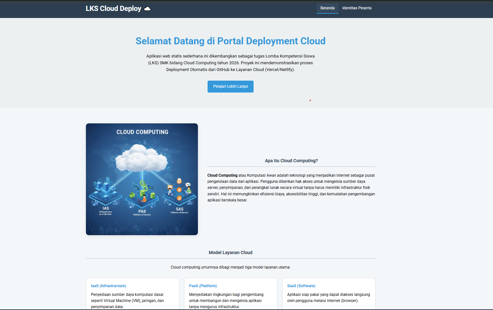
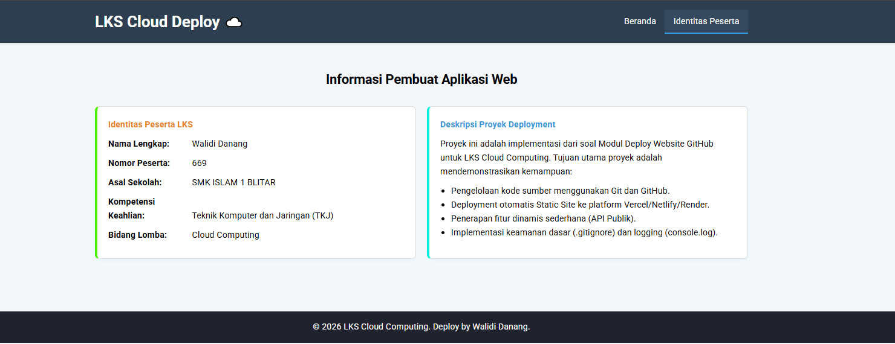

# Web Deployment - LKS Cloud Computing 2026

## 📝 Deskripsi Proyek
Aplikasi ini adalah sebuah Web App statis yang dibangun untuk memenuhi kualifikasi LKS SMK Ma'arif NU Jatim 2026. Proyek ini mendemonstrasikan integrasi CI/CD (Continuous Integration/Continuous Deployment) menggunakan GitHub sebagai Version Control dan Vercel sebagai Platform-as-a-Service (PaaS).

**Fitur Utama:**
* **Konten Edukasi**: Penjelasan mengenai Cloud Computing (IaaS, PaaS, SaaS).
* **Fitur Dinamis**: Mengambil data secara asinkron dari API Publik (JSONPlaceholder).
* **Logging System**: Pemantauan status aplikasi melalui browser console.
* **Responsive Design**: Tampilan yang optimal di berbagai ukuran perangkat.

## 🚀 Langkah Deployment
1.  **Version Control**: Inisialisasi Git lokal dan push kode ke GitHub Repository.
2.  **PaaS Integration**: Menghubungkan akun Vercel dengan repositori GitHub.
3.  **Auto Deployment**: Vercel secara otomatis mendeteksi perubahan pada branch `main` dan melakukan build ulang (CI/CD).
4.  **Verification**: Memastikan website dapat diakses melalui domain HTTPS yang disediakan.

## 🛠️ Teknologi yang Digunakan
* **Frontend**: HTML5, CSS3, JavaScript (Vanilla).
* **API**: JSONPlaceholder (External REST API).
* **Platform**: GitHub (SCM) & Vercel (Cloud Hosting).

## 🛡️ Keamanan & Optimasi
* **HTTPS**: Enkripsi SSL otomatis dari Vercel untuk keamanan transmisi data.
* **Clean Code**: JavaScript ditempatkan secara internal/modular untuk menghindari error 404 pada jalur file.
* **Error Handling**: Implementasi `.catch()` pada fungsi fetch untuk menangani kegagalan API.

## 📸 Tampilan Aplikasi
Berikut adalah tampilan antarmuka dari Web App LKS Cloud Computing 2026:

### Beranda (Desktop)

*Menampilkan hero section, pengertian Cloud Computing, dan model layanan (IaaS, PaaS, SaaS).*

### Fitur API Dinamis

*Menampilkan hasil pengambilan data secara real-time dari API publik.*

### Identitas Peserta (Tentang Saya)

*Halaman identitas resmi peserta LKS.*

## 🔗 Tautan Penting
* **Repositori**: (https://github.com/ptrdanang/lks-cloud-671.git)
* **Link Web**: (https://lks-cloud-671.vercel.app/)

---
**Identitas Peserta:**
* **Nama**: Walidi Danang
* **Bidang**: Cloud Computing - LKS 2026